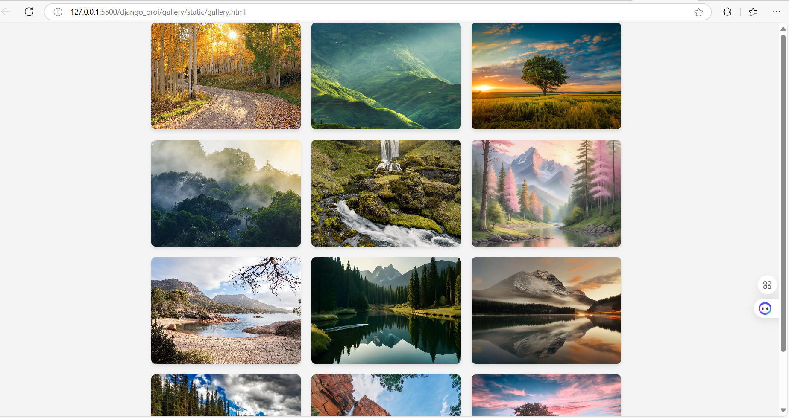
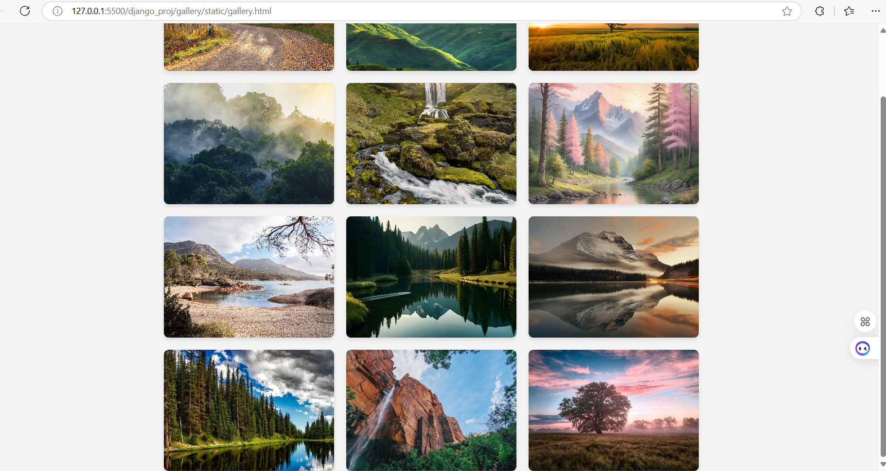

# Ex.08 Design of Interactive Image Gallery
# Date:16/11/24
# AIM:
To design a web application for an inteactive image gallery with minimum five images.

# DESIGN STEPS:
## Step 1:
Clone the github repository and create Django admin interface.

## Step 2:
Change settings.py file to allow request from all hosts.

## Step 3:
Use CSS for positioning and styling.

## Step 4:
Write JavaScript program for implementing interactivity.

## Step 5:
Validate the HTML and CSS code.

## Step 6:
Publish the website in the given URL.

# PROGRAM :

# index.html

    <!DOCTYPE html>
    <html lang="en">
    <head>
    <meta charset="UTF-8">
    <meta name="viewport" content="width=device-width, initial-scale=1.0">
    <title>Interactive Image Gallery</title>
    <link rel="stylesheet" href="styles.css">
    </head>
    <body>
    

        

        
        

        

        
        

        

        
        

        

        
        

        

        
        

        

        
        

        

        
        

        

        
        

        

        
        

        

        
        

        

        
        

        

        
        

        
    

    </body>
    </html>

# styles.css

    body {
    font-family: Arial, sans-serif;
    margin: 0;
    padding: 0;
    display: flex;
    justify-content: center;
    align-items: center;
    min-height: 100vh;
    background-color: #f4f4f4;
    }

    .gallery {
    display: flex;
    flex-wrap: wrap; /* Allows images to wrap to the next row */
    gap: 20px; /* Space between images */
    justify-content: center; /* Center align the gallery */
    max-width: 900px; /* Adjust the max width to fit 3 images per row */
    }

    .image-container {
    overflow: hidden;
    width: 280px; /* Adjusted width to fit 3 images per row */
    height: 200px;
    border-radius: 8px;
    box-shadow: 0 4px 6px rgba(0, 0, 0, 0.1);
    }

    .image-container img {
    width: 100%;
    height: 100%;
    object-fit: cover;
    transition: transform 0.3s ease-in-out;
    }

    .image-container:hover img {
    transform: scale(1.2); /* Zoom effect on hover */
    }

# OUTPUT:

# RESULT:
The program for designing an interactive image gallery using HTML, CSS and JavaScript is executed successfully.
